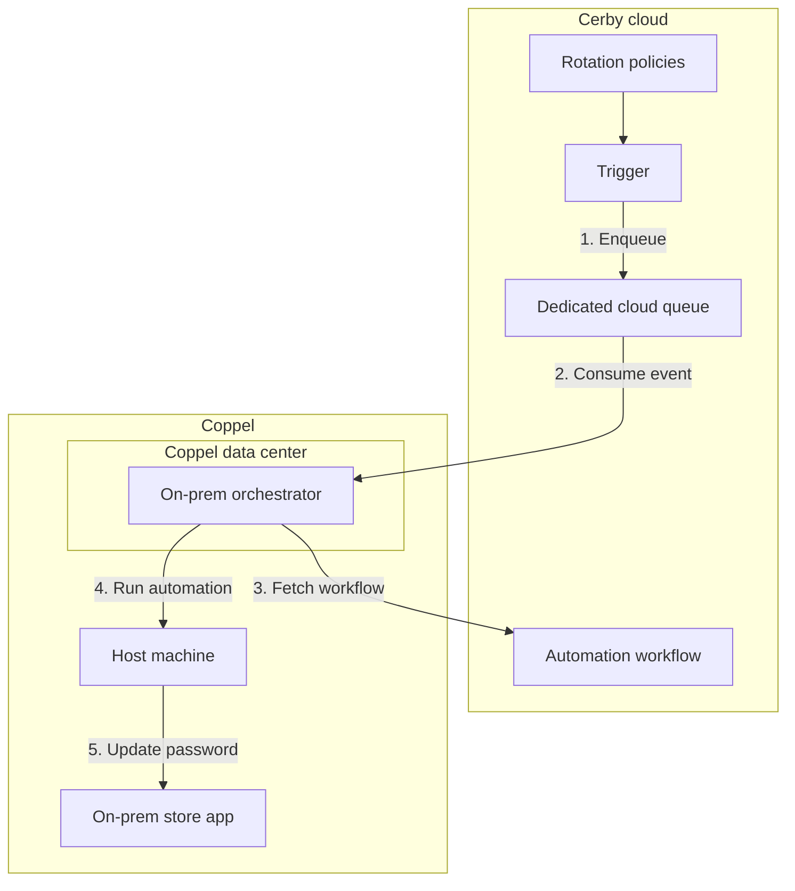
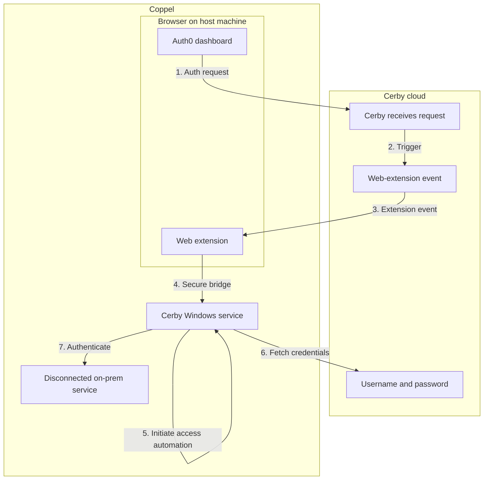

# Coppel SSO to On-Prem — Proposal

## Project information

| | |
|--|--|
| **Project** | Coppel SSO to on-prem |
| **Summary** | Enable SSO-like access from Auth0 to a disconnected on-prem application: credentials stored and rotated securely (Phase 1), then transparent login from the Auth0 dashboard via Cerby on the host machine (Phase 2). Target scale is on the order of ~4k stores and ~50k users; the same capabilities can support additional disconnected systems later. |

---

## Background and motivation

Coppel uses a disconnected on-prem Windows application in physical stores. Roughly 50,000 users across some 4,000 stores access this system with individual usernames and passwords. Those credentials are not protected by a vault or governance today, and password rotation depends on manual effort. The store application is disconnected and not SAML-compliant, so it sits outside existing IAM and security governance.

Coppel wants a single sign-on–like experience: users go to the Auth0 dashboard, choose the store application (via a tile that points to Cerby), and are logged in on the host machine without handling credentials. Achieving that requires securing and rotating credentials first, then adding local automation so that login can be triggered from the browser and completed on the host. This proposal outlines a two-phase approach with Cerby and Coppel (and Tec360 as the technology partner implementing IAM governance) working together.

---

## Goal

- **Phase 1:** User accounts in a secure vault (Cerby EPM) with periodic password rotation driven by Cerby policies and an on-prem orchestrator in Coppel’s environment.
- **Phase 2:** Users do not need to know their credentials. They open the Auth0 dashboard, trigger an authentication request that is routed to Cerby, and Cerby (web extension and Windows service on the host) completes login to the disconnected on-prem application on their behalf.

Success looks like: store users access the disconnected on-prem application by starting from Auth0 and triggering a login that runs automatically on the host machine, without ever seeing or entering a password.

---

## Scope

**In scope**

- Phase 1: EPM onboarding, password rotation support for that system, rotation policies, and an on-prem orchestrator in the Coppel data center that consumes rotation events and runs the automation on the host.
- Phase 2: Secure communication from the web extension to the Cerby Windows service on the host, and access automation that fetches credentials from Cerby and logs the user into the disconnected service.
- Once these capabilities exist, the same model can support other disconnected systems.

**Assumption**

- The target on-prem application exposes a screen or flow (e.g. change-password or admin UI) that desktop automation can use to update the password on behalf of the user. This is required for Phase 1 rotation.

---

## Plan

### Phase 1 — EPM and password rotation

- Cerby onboards the target system user accounts into the Enterprise Password Manager (EPM).
- Cerby adds password rotation support for the target disconnected system and defines rotation policies.
- Cerby configures an on-prem node within Coppel's data center to perform automatic password rotations for the 50,000 user accounts.

**Value:** Credentials are stored securely and rotated on a schedule, shortening the window of exposure from static or rarely changed passwords.

**Note:** Once Cerby rotates credentials, end users who authenticate manually (before Phase 2 is in place) must use the Cerby EPM to retrieve the new passwords.

---

### Phase 2 — SSO-like login to on-prem

- Cerby develops secure local communication (bridge) from the web extension to the Cerby Windows service on the host machine.
- Cerby develops access automation that runs on the host: the user’s authentication request from Auth0 is routed to Cerby; Cerby triggers a web-extension event in the browser; the extension talks over a secure bridge to the Windows service; the service fetches username and password from Cerby and runs the automation to log the user into the disconnected on-prem service.

**Value:** Users get a single sign-on–like experience for the disconnected store system: they use Auth0 and do not need to know or enter credentials for the on-prem application.

---

## Benefits

**Solution-level**

- Secure storage of credentials in Cerby EPM.
- Automatic password rotation driven by policies and on-prem automation.
- SSO-like access: users trigger login from Auth0 and are signed in on the host without handling passwords.

**Business outcomes**

- Stronger security posture and alignment with IAM governance (e.g. Tec360-led initiatives).
- Credentials and access for the disconnected store system can be brought under the same policies and audit as the rest of the identity landscape.
- Less reliance on manual password handling and rotation; potential for fewer help-desk and access-related issues and faster, consistent access for store employees.

---

## Deployment and commercial note

Cerby technology can be customized to support this scenario. This would be a custom, non-standard deployment. Additional Professional Services costs would apply on top of product licenses when and if the engagement is accepted.